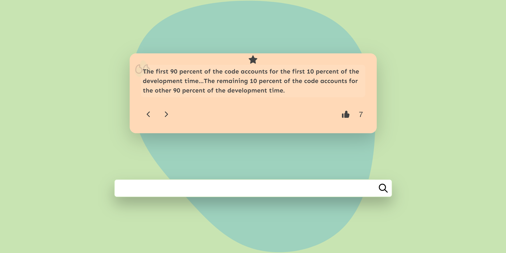

# AnecdoQuotes - FullStack Open Anecdotes Web App

Welcome to AnecdoQuotes FullStack Open Anecdote Web App! This application allows users to create, view, and vote on anecdotes. It's a simple yet engaging web app developed as part of the FullStack Open course.

## Table of Contents

- [Introduction](#introduction)
- [Preview](#preview)
- [Features](#features)
- [Technologies Used](#technologies-used)
- [Getting Started](#getting-started)
  - [Prerequisites](#prerequisites)
  - [Installation](#installation)
  - [Running the App](#running-the-app)
- [Contributing](#contributing)
- [License](#license)

## Introduction

This anecdote web app is built as a part of the FullStack Open course, which focuses on teaching modern web development using JavaScript, React, Node.js, and other related technologies. The app allows users to add their favorite anecdotes, vote on existing ones, and see the anecdotes in a paginated view.

## Preview



## Features

- Create and submit new anecdotes.
- Vote for your favorite anecdotes.
- View anecdotes in a pagination typa view.
- Responsive and user-friendly interface.

## Technologies Used

- **React.js**
- **CSS**
- **Redux** (optional, based on course progress)
- [**Render**](https://render.com)

## Getting Started

Follow the instructions below to get the project up and running on your local machine.

### Prerequisites

Make sure you have the following installed on your machine:

- [Node.js](https://nodejs.org) >=16.0.0

### Installation

#### Clone this repository:

```sh
  git clone git@github.com:purrrplelipton/AnecdoQuotes.git
```

### Running the App:

#### Navigate to the project directory:

```sh
  cd AnecdoQuotes
```

#### Install dependencies:

```sh
  npm install
```

#### Run the development server:

```sh
npm run dev
```

Open your browser and access the app at [http://localhost:5173](http://localhost:5173).

## Contributing

Contributions are welcome! If you find any bugs or want to improve the app, feel free to open issues or submit pull requests. Please make sure to follow the code of conduct while contributing.

## License

This project is licensed under the [MIT License](LICENSE).

---

Enjoy using [AnecdoQuotes](https://anecdoquotes.onrender.com) and happy coding!
